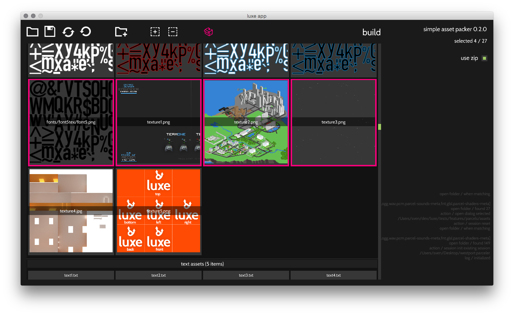

# assetpacker
A simple asset packer for luxe alpha versions.



# build

`flow run` as a regular luxe project in `tool/`

# requires
- `luxe`
- `mint`
- `linc_dialogs`

# targets

Works for native (mac/windows/linux/android/ios) and web targets.

Used in a few games like [Westport Independent](http://www.doublezeroonezero.com/westport.html) and the [THREES web port](http://play.threesgame.com/).

# tool usage

- click `add folder` to add an asset folder to the session
- once added, assets will be selectable to include in the built parcel
- use select all/none to toggle selections
- click `build` to generate the packed parcel file
- when hovering an asset, spacebar can be used to "quickview" the asset contents in a bigger view

# using the packed files, i.e Pack.hx usage

- This is the way you _use_ a packed parcel in your game
- Drop Pack.hx somewhere in your code
- see `test/` for a simple example
- The parcel is loaded as a whole, putting resources in to `Luxe.resources`
- Use the resources as usual

# using the packed file outside of luxe

The class that does the work for the asset packing and unpacking 
doesn't have any dependencies, it uses plain haxe features.
An agnostic version is inside `non-luxe/Packer.hx`.

If you want to use this in any haxe project, you can customize
the types in the AssetPack easily and the rest will still work automatically.

The asset packs generated by the tool will work
for frameworks or code not using luxe, the asset unpacking simply 
undoes the packing / compression, you have to feed that to your framework
as needed!

```haxe
    var to_pack:AssetPack = {
        bytes: ..
        ...
    }
    var bytes = Packer.compress_pack(to_pack);
    var unpacked = Packer.uncompress_pack(bytes);

    for(item in unpacked.bytes) {
        ..
    }
```

# important notes

- This tool was written very quickly, expect messy code (some [dev notes](http://snowkit.org/2015/08/10/snowkit-dev-log-6-community/#assetpackerround2))
- all asset types except streamed audio that luxe supports can be packed
- no streaming audio can be packed with this!
    + a path for audio/music is hardcoded internally to be ignored
- asset paths are relative to the `assets/` once added to the parcel
    + for example, add a folder called `assets/` with `assets/images/level.png`
    + in the packed assets it has the `id` of `assets/images/level.png`
    + when loading the packed assets, the id's will match this pattern
    + based on common usage, this should be transparent

# load time meta data
Some assets want to set load time settings, there is an optional meta file for these types of settings. 

This file is currently manually created and matches the format of the parcel json info. Only the shader specifics are currently implemented. It should be in the root of your parcel.

- parcel-shaders-meta - json of [`ShaderInfo`](https://luxeengine.com/docs/api/luxe/ShaderInfo.html)

Other types for sounds and textures were partially implemented but not needed at the time. The UI for editing the metadata was also partially implemented but commented out.

# other notes

http://iconmonstr.com/

# contributing

Feel free to file issues or contributions. 

Since this tool is a quick but useful tool written for the earlier alpha versions of luxe, I don't expect it to get significant reworking any time soon. 

# license 

MIT (LICENSE.md)